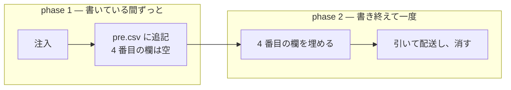

# 二相の構え

[捕獲から行き先まで](../L4_structures/flow.md)の矢印は同じ太さで描かれているが、左右で走る回数が違う。

## 相の境目は行の 4 番目の欄

[row](../L4_structures/row.md) の `kind` は捕獲の時点で空である。**空のまま増える区間が phase 1 で、埋めてから
減らす区間が phase 2 になる。**どちらの相に居るかは、この一欄だけで分かる。

phase 1 に属する処理が 4 番目の欄に触ることは無い。書くのは 5 番目までである。

## phase 1 を実行するコードは無い

[構成](../L4_structures/architecture.md)の plugin は `.js` を二本、`.md` を七枚持つ。捕獲へ向かう矢印には `.js` が
一本も掛かっていない。`periplus-activate.js` がするのは注入までで、追記そのものは session の
側で起きる。

**振る舞いを足すとき、それが `.js` の側か `.md` の側かで性質が変わる。**前者は決定的に動き、
後者は読まれなければ動かない。

## 入口のうち二つだけが相に属する

[注入](../L4_structures/injection.md)の四つの入口のうち、phase 1 に効くのは `SessionStart` と `SubagentStart` である。
`install` と `criteria` は `.periplus/` に触れず、相の外にある。

## Meaning
- [pre-comment](../L4_ubiquitous/pre-comment.md)
    - pre-comment
- [kind](../L4_ubiquitous/kind.md)
    - 種別(kind)

## Structures
- [捕獲から行き先まで](../L4_structures/flow.md)
- [row](../L4_structures/row.md)
- [構成](../L4_structures/architecture.md)
- [注入](../L4_structures/injection.md)
