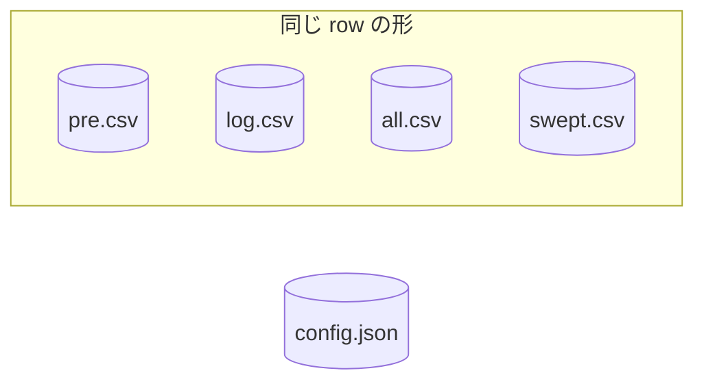

# 状態の置き方

[構成](../L4_structures/architecture.md)の workspace には五つのファイルがある。四つは [row](../L4_structures/row.md) の同じ形を共有し、
`config.json` だけが行を持たない。

行の読み書きは一つで足り、`config.json` にだけ別の読み手が要る。

## コマンドは値を運ばない

コマンド同士を直接結ぶ矢印は `/pp` から出る二本だけで、どちらにも中身が乗っていない。残りは
すべて workspace のファイルへ向かう。**受け渡しはファイルだけで行われる。**

## 中断できる粒度は一行

[保管](../L4_structures/archive.md)は追記と削除を一行ずつ行う。[row](../L4_structures/row.md) は一行が一つのことだけを述べると定める。
二つを重ねると、**どこで止めても行の意味が壊れない**ことが言える。まとめて消す実装は、この
性質を失う。

## 途中の状態は欄で数えられる

`pre.csv` に残る行数が未配送で、そのうち [row](../L4_structures/row.md) の 4 番目が空のものが未分類である。差が
「分類は済んだが配送されていない」にあたる。**状態を別に持たなくても、行を数えれば出る。**

## Meaning
- [pre-comment](../L4_ubiquitous/pre-comment.md)
    - pre-comment
- [kind](../L4_ubiquitous/kind.md)
    - 種別(kind)

## Structures
- [構成](../L4_structures/architecture.md)
- [row](../L4_structures/row.md)
- [保管](../L4_structures/archive.md)
- [config.json](../L4_structures/config.md)
