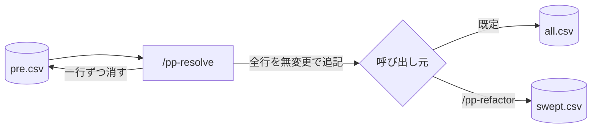

# 保管

`/pp-resolve` は行き先に関わらず全行を保管に写し、`pre.csv` から消す。

保管は一箇所で、編集も排出もされない。`/pp-refactor` だけが[別の保管を指す](../L5_adr/0018-sweeps-archive-separately.md)。既存の
コメントを切り出した行が `all.csv` に混ざると、捕獲された[記述](../L4_ubiquitous/pre-comment.md)と区別できなくなるため。

## Meaning
- [pre-comment](../L4_ubiquitous/pre-comment.md)
    - pre-comment

## Decisions
- [ADR 0015](../L5_adr/0015-one-archive-in-the-workspace.md)
    - 作業場の保管は一つ
- [ADR 0018](../L5_adr/0018-sweeps-archive-separately.md)
    - sweep は別に保管する
- [ADR 0017](../L5_adr/0017-refactor-cuts-instead-of-copying.md)
    - `/pp-refactor` は複製ではなく切り出す
