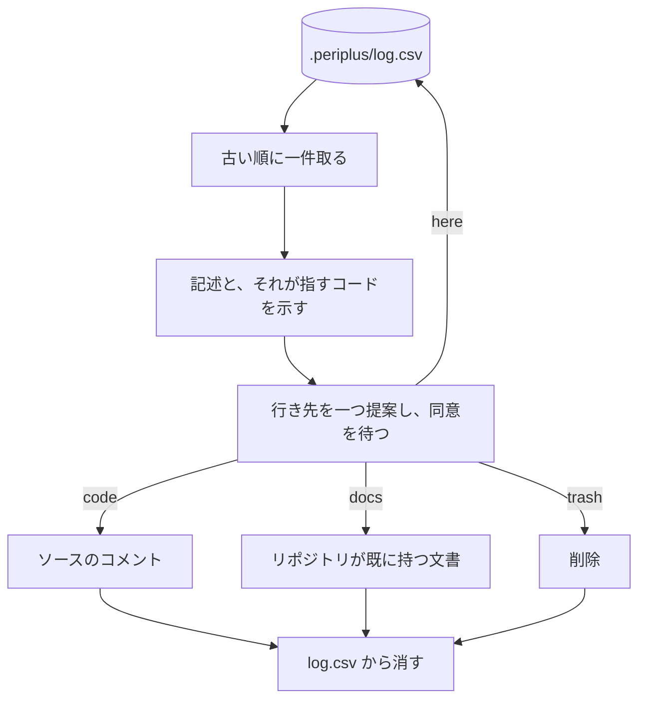

# log の行き先

`.periplus/log.csv` に溜まった記述を、一件ずつ四つの行き先へ送る。

[`here`](../L4_ubiquitous/CONTEXT.md#here) だけが log に残る。[残ることは失敗ではなく](../L5_adr/0023-the-log-is-evidence-for-writing-a-document.md#no-exit-required)、決着していない[記述](../L4_ubiquitous/CONTEXT.md#pre-comment)の既定の姿である。

## Meaning
- [CONTEXT.md#code](../L4_ubiquitous/CONTEXT.md#code)
- [CONTEXT.md#docs](../L4_ubiquitous/CONTEXT.md#docs)
- [CONTEXT.md#here](../L4_ubiquitous/CONTEXT.md#here)
- [CONTEXT.md#trash](../L4_ubiquitous/CONTEXT.md#trash)

## Decisions
- [ADR 0019](../L5_adr/0019-the-log-has-one-command.md)
    - ログを扱うコマンドを一つにする
- [ADR 0020#per-repository](../L5_adr/0020-the-log-drains-into-whatever-documents-the-repository-keeps.md#per-repository)
    - 行き先の文書はリポジトリごとに違う
- [ADR 0020#here](../L5_adr/0020-the-log-drains-into-whatever-documents-the-repository-keeps.md#here)
    - `here` を行き先の一つにする
- [ADR 0023#no-exit-required](../L5_adr/0023-the-log-is-evidence-for-writing-a-document.md#no-exit-required)
    - 出口を要求しない
- [ADR 0023#here-vs-docs](../L5_adr/0023-the-log-is-evidence-for-writing-a-document.md#here-vs-docs)
    - `here` と `docs` の境界
- [ADR 0021](../L5_adr/0021-fixing-the-code-is-not-part-of-the-notes-pipeline.md)
    - コードを直す判断はこの経路に属さない
