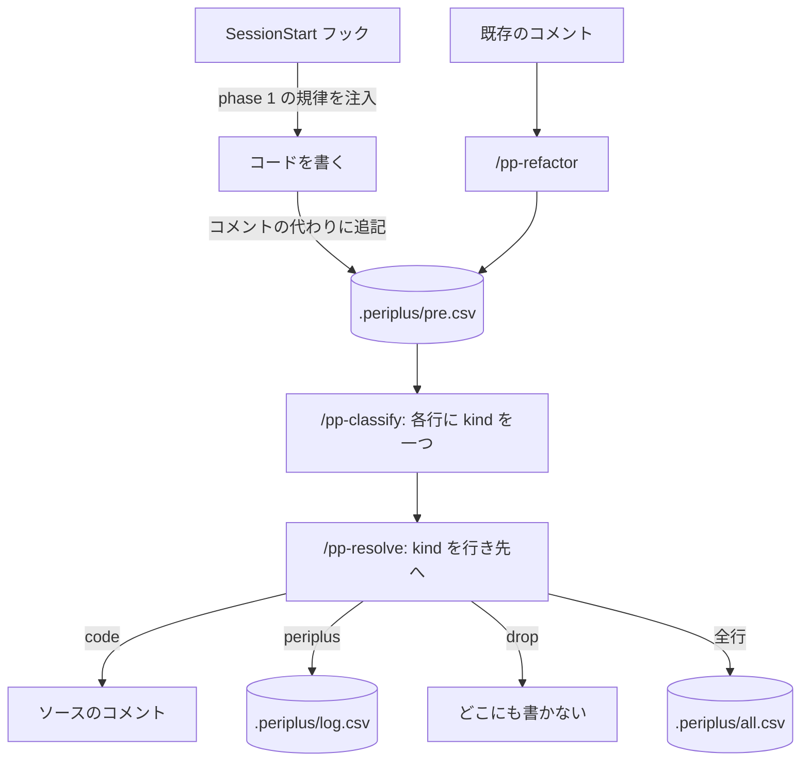

# 捕獲から行き先まで

コードを書いている間の捕獲と、書き終えた後の濾過。

`/pp` は `/pp-classify` と `/pp-resolve` をこの順で続けて呼ぶ。
`log.csv` から先は [log の行き先](discuss.md)。

## Meaning
- [CONTEXT.md#pre-comment](../L4_ubiquitous/CONTEXT.md#pre-comment)
- [CONTEXT.md#periplus](../L4_ubiquitous/CONTEXT.md#periplus)

## Decisions
- [ADR 0036](../L5_adr/0036-phase-1-belongs-to-the-hook.md) — phase 1 はフックが持つ
- [ADR 0006](../L5_adr/0006-capture-first-filter-last.md) — 先に捕獲し、最後に濾す
- [ADR 0016](../L5_adr/0016-classify-and-resolve-are-separate-commands.md) — classify と resolve を分ける
- [ADR 0033](../L5_adr/0033-pp-runs-all-three-and-the-capture-rule-is-a-skill.md) — `/pp` が続けて呼ぶ
- [ADR 0015](../L5_adr/0015-one-archive-in-the-workspace.md) — 保管は一つ
- [ADR 0018](../L5_adr/0018-sweeps-archive-separately.md) — sweep は別に保管する
- [ADR 0017](../L5_adr/0017-refactor-cuts-instead-of-copying.md) — `/pp-refactor` は複製ではなく切り出す
