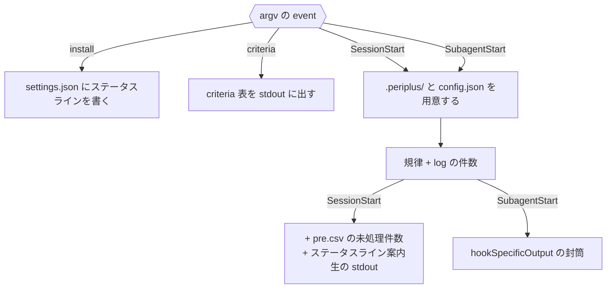

# 注入

`periplus-activate.js` は四つの入口を持ち、注入する内容が入口ごとに違う。

| | SessionStart | SubagentStart |
| --- | --- | --- |
| phase 1 の規律 | ○ | ○ |
| `log.csv` の件数 | ○ | ○ |
| `pre.csv` の未処理件数 | ○ | × |
| ステータスライン案内 | ○ | × |
| 出力形式 | 生の stdout | `hookSpecificOutput` |

`install` と `criteria` は `.periplus/` に触れない。作業場の用意が失敗しても規律は注入される。

## Meaning
- [pre-comment](../L4_ubiquitous/pre-comment.md)
    - pre-comment
- [periplus](../L4_ubiquitous/periplus.md)
    - periplus

## Decisions
- [ADR 0036](../L5_adr/0036-phase-1-belongs-to-the-hook.md)
    - phase 1 はフックが持つ
- [ADR 0007](../L5_adr/0007-inject-only-the-capture-rule.md)
    - 注入するのは捕獲の規律だけ
- [ADR 0028](../L5_adr/0028-subagents-get-the-discipline-not-the-parents-backlog.md)
    - サブエージェントに親の未処理は渡さない
- [ADR 0011](../L5_adr/0011-ask-for-the-status-line-never-install-it-unasked.md)
    - ステータスラインは頼まれない限り入れない
