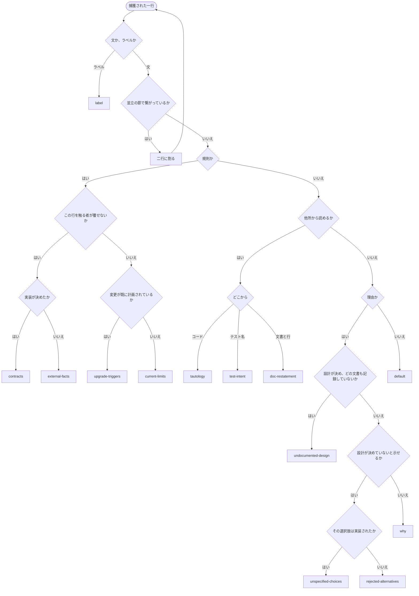

# kind

```ebnf
kind = "contracts" | "external-facts" | "current-limits"
     | "upgrade-triggers" | "tautology" | "test-intent"
     | "doc-restatement" | "undocumented-design"
     | "unspecified-choices" | "rejected-alternatives" | "why"
     | "label" | "default" ;
```

## 判別

一行から [`kind`](../L4_ubiquitous/CONTEXT.md#kind) 一つを決める木。表は名前を並べるだけで、分けるのは[この木だけ](../L5_adr/0035-the-tree-classifies-and-the-table-only-names.md#three-questions)である。



割る操作は名前を付ける前に来る。割った結果がさらに二つを含むことがあるため、木は
自分自身に戻る。[文書として数える](../L5_adr/0030-the-design-documents-stand-in-for-the-session.md)のはこのリポジトリが持続的に保つものだけで、会話は
数えない。

## Meaning
- [CONTEXT.md#kind](../L4_ubiquitous/CONTEXT.md#kind)

## Decisions
- [ADR 0014#closed-set](../L5_adr/0014-the-set-of-kinds-is-closed.md#closed-set) — 集合を閉じる
- [ADR 0004](../L5_adr/0004-deliberate-deviation-is-not-a-criterion.md) — `deliberate-deviation` を外す
- [ADR 0022](../L5_adr/0022-a-kind-for-choices-the-design-did-not-specify.md) — `unspecified-choices` を足す
- [ADR 0029#doc-restatement](../L5_adr/0029-a-reason-is-sorted-by-who-decided-it-and-what-records-it.md#doc-restatement) — `doc-references` を `doc-restatement` に改名
- [ADR 0029#why-residual](../L5_adr/0029-a-reason-is-sorted-by-who-decided-it-and-what-records-it.md#why-residual) — `undocumented-design` を足し、`why` を残余にする
- [ADR 0035#default](../L5_adr/0035-the-tree-classifies-and-the-table-only-names.md#default) — `history` を落とし、`default` を足す
- [ADR 0035#label](../L5_adr/0035-the-tree-classifies-and-the-table-only-names.md#label) — `block-headings` を `label` に改名
- [ADR 0035#three-questions](../L5_adr/0035-the-tree-classifies-and-the-table-only-names.md#three-questions) — 記述の形を三問で決め、判定を枝に置く
- [ADR 0013](../L5_adr/0013-split-to-one-kind-at-capture.md) — 捕獲の時点で kind 一つまで割る
- [ADR 0025](../L5_adr/0025-splitting-presumes-two.md) — 分割は推定有罪
- [ADR 0030](../L5_adr/0030-the-design-documents-stand-in-for-the-session.md) — 会話は文書に数えない
