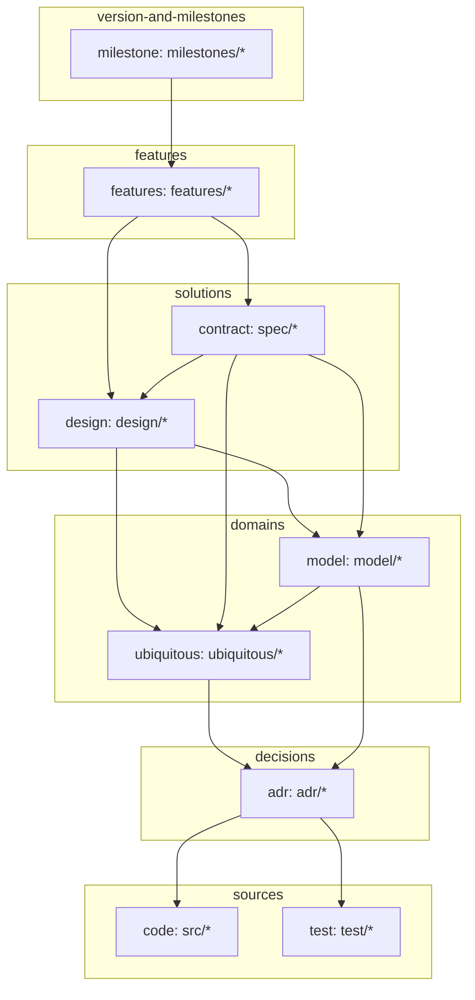

# Overview

リポジトリにおける、情報参照の順序を決める。
矢印は参照の方向。

## 各ノード

- **milestone** — 版の単位。その版が触れた feature を指す
- **feature** — 機能の単位。利用者が名指しできるものを一つとする
- **contract** — 要件を満たす what。外から観測できる約束と、その検証
- **design** — 要件に対する how。実装の中身
- **model** — 型や schema など、構造そのもの
- **ubiquitous** — 語の辞書。語の意味を一項目ずつ説明する
- **adr** — 決定とその理由
- **code** / **test** — 実装と検証

## リポジトリごとの適用

この図は一般構造であり、使う層はリポジトリが選ぶ。periplus 自身では次の通り。

- **code** — `skills/*` と `hooks/*`
- **model** — kind の構造。名前の一覧と ubiquitous への参照を持つ
- **test** — 工程はあるが、ファイルとして残していない
