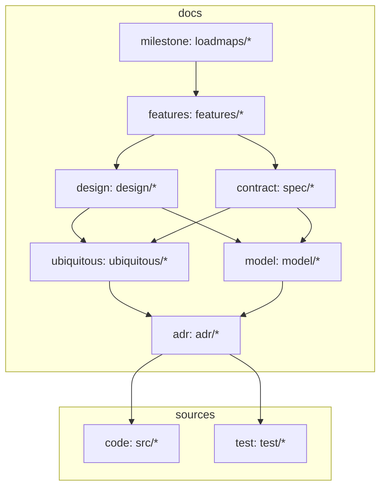

# Docs

Docにおける、情報参照の順序を決める。
上流が下流の内容をリンクで参照するルール。循環しないようにする。

```mermaid
flowchart TD

    subgraph docs
        milestone[milestone: loadmaps/*]
        feature[features: features/*]
        design[design: design/*]
        contract[contract: spec/*]
        adr[adr: adr/*]
        ubiquitous[ubiquitous: ubiquitous/*]
        model[model: model/*]
    end

    subgraph sources
        code[code: src/*]
        test[test: test/*]
    end

    milestone --> feature
    feature --> design
    feature --> contract
    design --> ubiquitous
    design --> model
    contract --> ubiquitous
    contract --> model
    ubiquitous --> adr
    model --> adr
    adr --> code
    adr --> test

```
