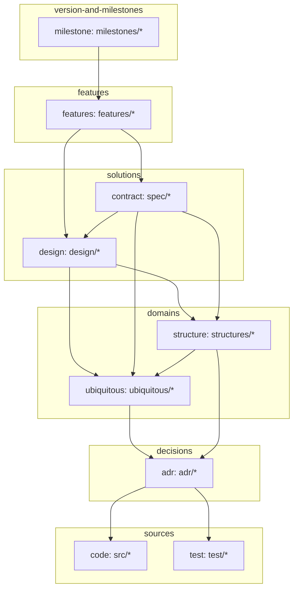

# Overview

リポジトリにおける、情報参照の順序を決める。
矢印は参照の方向。

層は、一つ下の層の要素が消えたときに一緒に消えるかどうかで分かれる。
土台は下にあり、影響は下層から上層へ波及する。



## 各ノード

- **milestone** — 版の単位。その版が触れた feature を指す
- **feature** — 機能の単位。利用者が名指しできるものを一つとする
- **contract** — 要件を満たす what。外から観測できる約束と、その検証
- **design** — 要件に対する how。実装の中身
- **structure** — 型や schema、コンポーネントの関係など、構造そのもの
- **ubiquitous** — 語の辞書。語の意味を一項目ずつ説明する
- **adr** — 決定とその理由
- **code** / **test** — 実装と検証

## リポジトリごとの適用

この図は一般構造であり、使う層はリポジトリが選ぶ。periplus 自身では次の通り。

- **code** — `skills/*` と `hooks/*`
- **structure** — kind の構造と、フックから `/pp` を経て `pre.csv`・`log.csv` に至る通しのフロー図
- **test** — 工程はあるが、ファイルとして残していない

## 参照の書き方

参照は名前付きアンカーで張る。行番号は行が増減するとずれ、見出しは改名で切れる。

参照される側は、指される箇所の直前にアンカーを置く。

```html
<a id="kind"></a>
## 種別(kind)
```

参照する側は、相対パスとアンカー名で指す。

```markdown
[CONTEXT.md#kind](../ubiquitous/CONTEXT.md#kind)
```

id は文書内で一意にする。語を指すなら語そのもの、決定を指すなら主題を短く。
