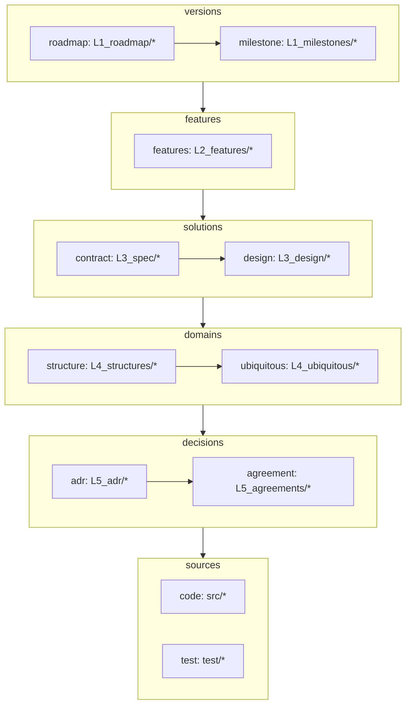

# Overview

リポジトリにおける、情報参照の順序を決める。
矢印は参照の方向。

層は、一つ下の層の要素が消えたときに一緒に消えるかどうかで分かれる。
土台は下にあり、影響は下層から上層へ波及する。

上の層のノードからは、下の層のどのノードへ引ける。



## 各ノード

- **milestone** — 実装済みの版の単位。その版が触れた L2 を指す
- **roadmap** — 将来版の単位。既存の L2 を基にして、次の版の方針を示す
- **feature** — 機能の単位。利用者が名指しできるものを一つとする
- **contract** — 要件を満たす what。外から観測できる約束と、その検証
- **design** — 要件に対する how。実装の中身
- **structure** — 型や schema、コンポーネントの関係など、構造そのもの
- **ubiquitous** — 語の辞書。語の意味を一項目ずつ説明する
- **adr** — トレードオフの結果として決めたこと。覆しにくい
- **agreement** — 揃えるための取り決め。別の選択肢でも動くが、揃っていることに価値がある
- **code** / **test** — 実装と検証

## リポジトリごとの適用

この図は一般構造であり、使う層はリポジトリが選ぶ。periplus 自身では次の通り。

- **code** — `skills/*` と `hooks/*`
- **structure** — kind の構造と、フックから `/pp` を経て `pre.csv`・`log.csv` に至る通しのフロー図
- **test** — 工程はあるが、ファイルとして残していない

## 参照の書き方

文書どうしの参照は名前付きアンカーで張る。行番号は行が増減するとずれ、見出しは改名で切れる。

ソースを指すときは行番号で指す。コードにアンカーは置けない。

参照される側は、指される箇所の直前にアンカーを置く。

```html
<a id="kind"></a>
## 種別(kind)
```

参照する側は、相対パスとアンカー名で指す。

```markdown
[CONTEXT.md#kind](../L4_ubiquitous/CONTEXT.md#kind)
```

id は文書内で一意にする。語を指すなら語そのもの、決定を指すなら主題を短く。

## 新しい話を入れるとき

**起点は L5 の決定である。**`L5_adr/` か `L5_agreements/` の一枚が固まったところから、
文書が始まる。

決まる前のものは層に入らない。精査の途中の材料や、まだ着手を決めていない論点は
`docs/` の直下に置く。層番号の付いていないものは、参照グラフの外にある。

決定が固まったら、そこから上へ層を展開する。L4 で語と構造を、L3 で約束と構えを、
L2 で機能を、L1 で版を書く。features も spec も無いまま ADR が先に立つのは、順序の
誤りではなく、この順序そのものである。

## L6 は動かせない

`L6` は現に動いている実装である。既にある話について文書と実装が食い違ったなら、
直すのは文書の側になる。

新しい話ではまだ実装が無く、そこへ向けて書く文書は事実ではなく予定である。
その区別が `_` の印にあたる。

## 出荷の条件

その話が触れた層の文書が揃い、リンクが下から上へ全て張られていること。

- 触れなかった層には何も足さない。層を飛ばさないことと、全ての層に一枚ずつ作ることは別である
- 既にある文書で足りるなら、指すだけでよい
- 揃ったら、roadmap の一枚を `L1_milestones/` へ移す

## 未実装の印

まだ実装に届いていない文書は、ファイル名の先頭に `_` を付ける。`_pp-discuss.md` は
「そう書いてあるが、まだそう動かない」を意味する。

実装が届いた時点で `_` を外し、指しているリンクを直す。`ls` に印が出るので、
どこまでが現物でどこからが予定かが一覧で読める。
