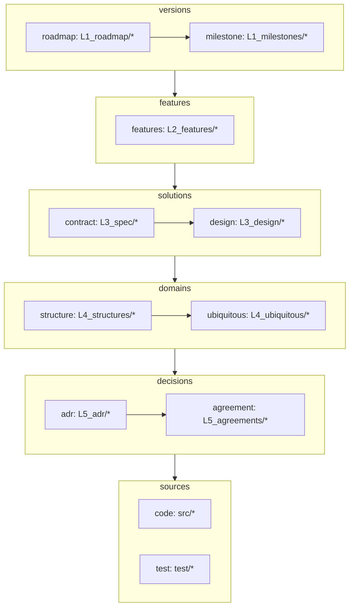

# Overview

リポジトリにおける、情報参照の順序を決める。
矢印は参照の方向。

層は、一つ下の層の要素が消えたときに一緒に消えるかどうかで分かれる。
土台は下にあり、影響は下層から上層へ波及する。

上の層のノードからは、下の層のどのノードへ引ける。



## 各ノード

- **milestone** — 実装済みの版の単位。その版が触れた L2 を指す
- **roadmap** — 将来版の単位。既存の L2 を基にして、次の版の方針を示す
- **feature** — 機能の単位。利用者が名指しできるものを一つとする
- **contract** — 要件を満たす what。外から観測できる約束と、その検証
- **design** — 要件に対する how。実装の中身
- **structure** — 型や schema、コンポーネントの関係など、構造そのもの
- **ubiquitous** — 語の辞書。語の意味を一項目ずつ説明する
- **adr** — トレードオフの結果として決めたこと。覆しにくい
- **agreement** — 揃えるための取り決め。別の選択肢でも動くが、揃っていることに価値がある
- **code** / **test** — 実装と検証

## リポジトリごとの適用

この図は一般構造であり、使う層はリポジトリが選ぶ。periplus 自身では次の通り。

- **code** — `skills/*` と `hooks/*`
- **structure** — kind の構造と、フックから `/pp` を経て `pre.csv`・`log.csv` に至る通しのフロー図
- **test** — 工程はあるが、ファイルとして残していない

## 参照の書き方

文書どうしの参照は名前付きアンカーで張る。行番号は行が増減するとずれ、見出しは改名で切れる。

ソースを指すときは行番号で指す。コードにアンカーは置けない。

参照される側は、指される箇所の直前にアンカーを置く。

```html
<a id="kind"></a>
## 種別(kind)
```

参照する側は、相対パスとアンカー名で指す。

```markdown
[CONTEXT.md#kind](../L4_ubiquitous/CONTEXT.md#kind)
```

id は文書内で一意にする。語を指すなら語そのもの、決定を指すなら主題を短く。

## 新しい話を入れるとき

1. **roadmap に一枚置く** — 何をしたいかを版の単位で書く。土台にする出荷済みの版を
   `## Milestones` に挙げる
2. **feature を見る** — 既にある機能なら何も作らない。新しい機能なら L2 に一枚作る
3. **contract を書く** — 外から何がどう変わるかを L3_spec に書く
4. **design を書く** — その約束をどう満たすかを L3_design に書く
5. **structure と ubiquitous を見る** — 新しい型や語が出たときだけ L4 に足す
6. **decision を書く** — トレードオフの結果なら L5_adr、揃えるための取り決めなら
   L5_agreements
7. **実装する**
8. **出荷したら** roadmap の一枚を milestones へ移す

書く順は上から下へ、**リンクを張る順は下から上へ**。下の層の文書が在って初めて上から
指せるので、一段書き終えるたびに一つ上へ戻ってリンクを足す。

変わらない層には何も足さない。層を飛ばさないことと、全ての層に一枚ずつ作ることは別である。

