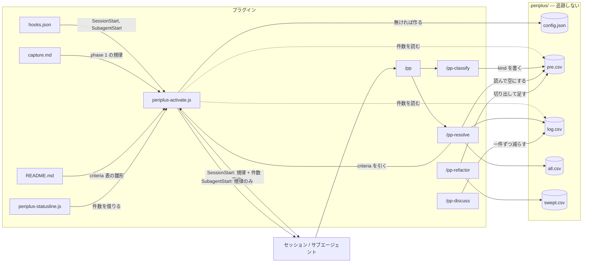

# 構成

プラグインの部品と、`.periplus/` の作業ファイルの関係。

入口ごとの差は [注入](injection.md)。

`/pp` は `/pp-classify` と `/pp-resolve` を順に呼ぶだけで、ファイルには触れない。
`config.json` を読むのは `/pp-resolve`・`/pp-discuss`・`/pp-refactor` で、
`/pp-classify` は読まない。

## Meaning
- [CONTEXT.md#periplus](../ubiquitous/CONTEXT.md#periplus) — periplus
- [CONTEXT.md#pre-comment](../ubiquitous/CONTEXT.md#pre-comment) — pre-comment

## Decisions
- [ADR 0001](../adr/0001-plugin-with-sessionstart-hook.md) — プラグインと SessionStart フックで配る
- [ADR 0036](../adr/0036-phase-1-belongs-to-the-hook.md) — phase 1 はフックが持つ
- [ADR 0028](../adr/0028-subagents-get-the-discipline-not-the-parents-backlog.md) — サブエージェントには規律だけを渡す
- [ADR 0009](../adr/0009-the-workspace-is-untracked-in-full.md) — `.periplus/` は config も含めて追跡しない
- [ADR 0024](../adr/0024-the-working-files-are-csv.md) — 作業ファイルは CSV
- [ADR 0027](../adr/0027-config-json-is-the-authority-for-destinations.md) — `config.json` が行き先の唯一の権威
- [ADR 0015](../adr/0015-one-archive-in-the-workspace.md) — 保管は一つ
- [ADR 0018](../adr/0018-sweeps-archive-separately.md) — sweep は別に保管する
- [ADR 0011](../adr/0011-ask-for-the-status-line-never-install-it-unasked.md) — ステータスラインは頼まれない限り入れない
- [ADR 0032](../adr/0032-a-procedure-lives-in-the-command-that-runs-it.md) — 手順はそれを実行するコマンドが持つ
