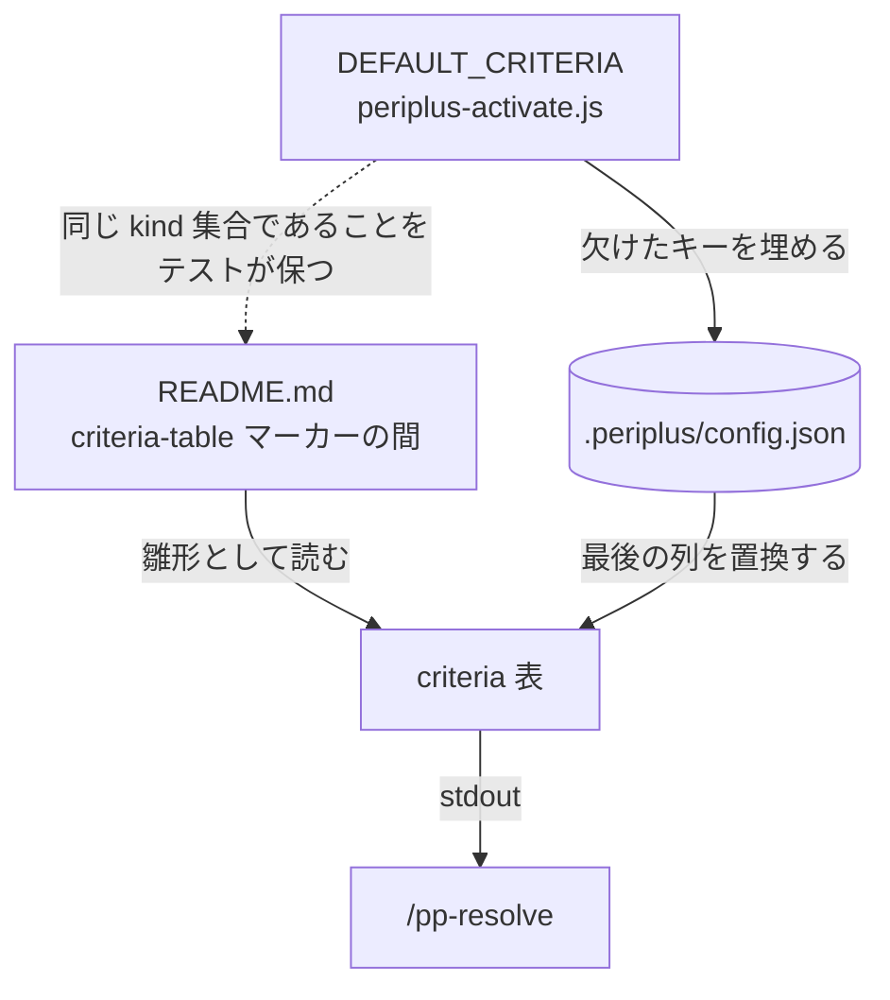

# 行き先の権威

[行き先](destination.md)の値は三箇所に現れる。実行時に効くのは [`config.json` だけ](../adr/0027-config-json-is-the-authority-for-destinations.md)。

README の `goes to` 列は出荷時の既定であり、表を出すときにリポジトリの値で置き換わる。
列を足さずに置き換えるのは、古い列が解決済みの列の隣に並ぶことを避けるため。

`config.json` に問題があった行は、表の後ろに `config.json: …` として並ぶ。そのキーだけが
無視され、残りは適用される。

## Meaning
- [CONTEXT.md#criterion](../ubiquitous/CONTEXT.md#criterion) — 判断基準(criterion)
- [CONTEXT.md#kind](../ubiquitous/CONTEXT.md#kind) — 種別(kind)

## Decisions
- [ADR 0027](../adr/0027-config-json-is-the-authority-for-destinations.md) — `config.json` が唯一の権威
- [ADR 0035#table-in-readme](../adr/0035-the-tree-classifies-and-the-table-only-names.md#table-in-readme) — 表は README にだけ置く
- [ADR 0014#mechanised-resolution](../adr/0014-the-set-of-kinds-is-closed.md#mechanised-resolution) — 解決は機械が行う
