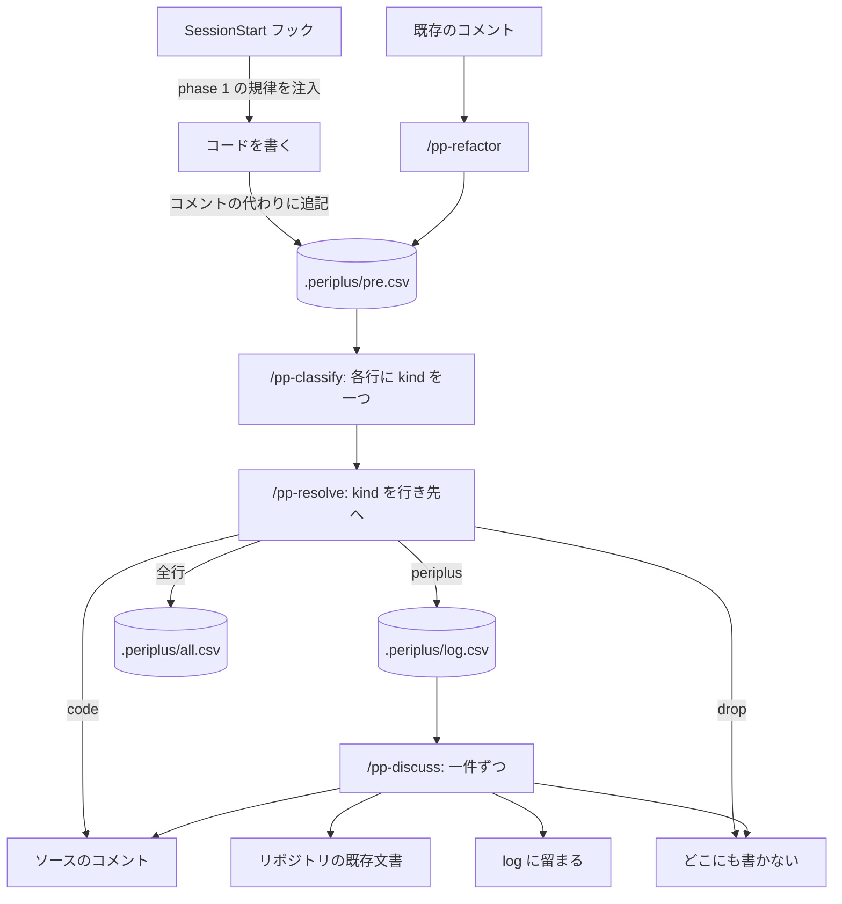

# 通しのフロー

捕獲から行き先までの全体。各コマンドが何をするかは `skills/*/SKILL.md` が持つ。

```mermaid
flowchart TD
    hook[SessionStart フック] -->|phase 1 の規律を注入| write[コードを書く]
    write -->|コメントの代わりに追記| pre[(.periplus/pre.csv)]
    existing[既存のコメント] --> refactor["/pp-refactor"]
    refactor --> pre

    pre --> classify["/pp-classify: 各行に kind を一つ"]
    classify --> resolve["/pp-resolve: kind を行き先へ"]

    resolve -->|code| src[ソースのコメント]
    resolve -->|periplus| log[(.periplus/log.csv)]
    resolve -->|drop| nowhere[どこにも書かない]
    resolve -->|全行| archive[(.periplus/all.csv)]

    log --> discuss["/pp-discuss: 一件ずつ"]
    discuss --> docs[リポジトリの既存文書]
    discuss --> src
    discuss --> here[log に留まる]
    discuss --> nowhere
```

`/pp` は `/pp-classify` と `/pp-resolve` をこの順で続けて呼ぶ一つのコマンドである。
