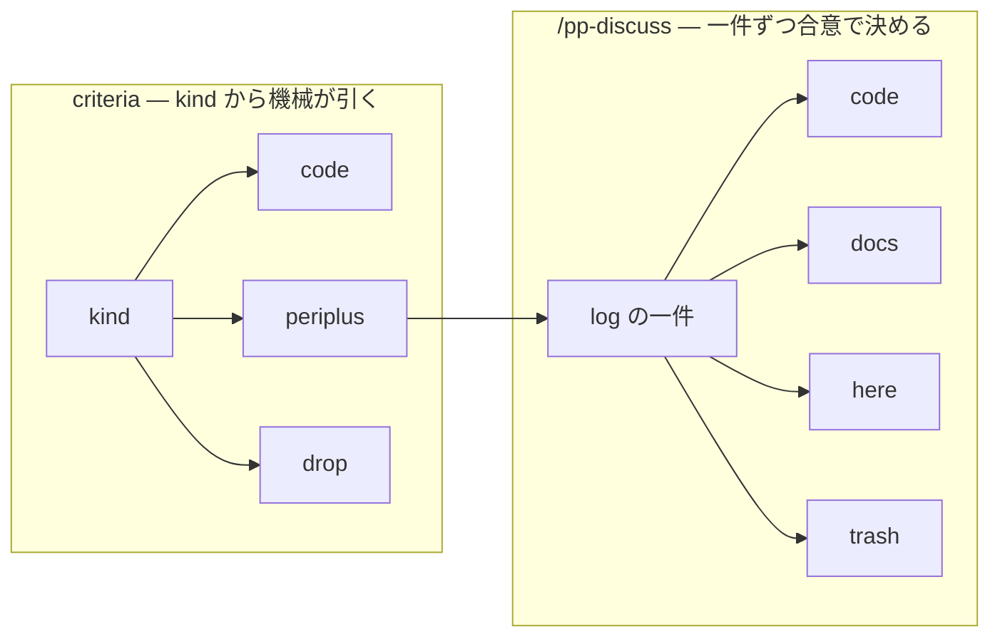

# 二つの行き先語彙

行き先を表す語は二組あり、別の段に属する。同じ綴りが両方に現れる。

| | criteria | /pp-discuss |
| --- | --- | --- |
| 決めるもの | kind | 記述一件 |
| 決め方 | `config.json` から機械が引く | 提案し、同意を待つ |
| 行き先 | `code` `periplus` `drop` | `code` `docs` `here` `trash` |

`code` は両方にある。criteria の `code` は kind ごと送る。`/pp-discuss` の [`code`](../ubiquitous/CONTEXT.md#code) は
一件から該当部分だけを切り出す救済路で、主経路ではない。

`drop` と [`trash`](../ubiquitous/CONTEXT.md#trash) は同じ行為で、段が違う。[`periplus`](../ubiquitous/CONTEXT.md#periplus) は criteria の行き先であり、
`/pp-discuss` の入口である。[`here`](../ubiquitous/CONTEXT.md#here) はそこに留まること。

## Meaning
- [CONTEXT.md#criterion](../ubiquitous/CONTEXT.md#criterion)
- [CONTEXT.md#code](../ubiquitous/CONTEXT.md#code)
- [CONTEXT.md#here](../ubiquitous/CONTEXT.md#here)

## Decisions
- [ADR 0003](../adr/0003-periplus-is-a-state-not-a-category.md) — periplus を状態として立てる
- [ADR 0020#per-repository](../adr/0020-the-log-drains-into-whatever-documents-the-repository-keeps.md#per-repository) — `/pp-discuss` の行き先はリポジトリごとに違う
- [ADR 0027](../adr/0027-config-json-is-the-authority-for-destinations.md) — criteria の行き先は `config.json` が決める
- [ADR 0031](../adr/0031-the-skills-hold-instructions-and-the-adrs-hold-the-reasons.md) — 二語彙の同居が誤読を生んだ記録
