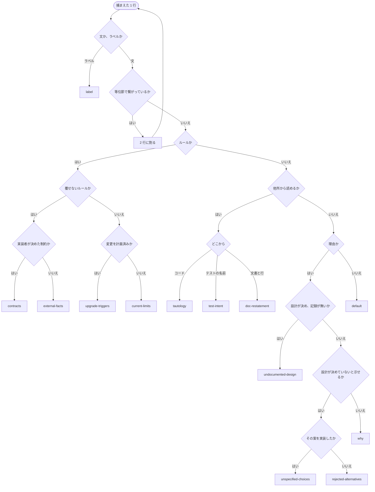

# v0.7.6 — 分類を一本のフローにする

v0.7.5 は表の 2 列目から分岐の文言を落とした。残っているのは、**表がまだ分類器として使われている**
ことである。順序が触るのは 13 種のうち 8 つで、残りは表の定義でしか決まらない。1 行が二つの分類器に
当たり、どちらを先に読むかはどこにも書かれていない。

ADR 0029:83 は「分けるのは順序」と決めている。順序に入口の無い種別がある限り、その決定は実装され
ていない。

## 決めたこと

**A. 記述の形を三問で決め、その中の判定を枝ごとに置く。** 下のコードがそのまま
`skills/pp-classify/SKILL.md` に入る(F)。

1 行が通る菱形は最大 4 つで、途中で表に戻らない。表は kind の内容を持つだけになり、分類には使わ
ない。

**「ルールか」が「他所から読めるか」より前にあること**が、ADR 0029:95 の「1 は 3 より前」を引き
継ぐ。文書化済みの外部事実が `doc-restatement` に吸われれば、ADR 0026 が数えた地雷 8 件がコード
から消える。いまは但し書きで支えているものが、枝の分かれ方で保たれる。

**B. 分岐は行き先の語彙を使わない**(ADR 0002)。「覆せない」は**その行を直す人には覆せない**の意味
である。実装者が決めた制約は実装者には覆せる。

`contracts` の定義がここで変わる。「シグネチャと型が表現していない義務」という残余の形をやめ、
**実装者が決めた制約**という主題になる。ADR 0029:21 が `doc-references` に当てた検査 —— 主題では
なく文の形を名乗る種別は発火しない —— から外れる。分ける軸は 0029 の「誰が決めたか」を事実側に
伸ばしたもので、`unspecified-choices` の「実装者の裁量」(ADR 0022)と同じ言葉を使う。

**C. `history` を落とす。**

文書化された変更は「他所から読めるか」が拾い、`doc-restatement` になる。文書化されていない変更は
「設計が決め、記録が無いか」に吸われる。どちらでもない領域が無い。ADR を書くリポジトリでは、記録に
値する変更はまず ADR になるためである。

**D. `default` を足す。** 三問のどれにも当たらない行の着き先で、`config.json` の既定は `periplus`。

`history` がその位置を塞いでいたので、C で露出する。ADR 0029 が `why` を残余にしたとき、残余とは
「判定できなかったことを判定できなかったまま記録する場所」だと書いた。`default` はその `why` すら
受けない行 —— 理由の形をしていないのに、ルールでも復元可能でもない行 —— の置き場である。

種別は 13 のまま。`history` が抜け、`default` が入る。ADR 0014 に当たるのは項目数ではなく、集合を
動かすことそのものである。

**E. `block-headings` を `label` に改名する。** 木の第一問は「文か、ラベルか」で、取れるのはラベル
であるという事実だけである。見出しかどうかはその先の話で、名前が事実より狭い。ADR 0029 が
`doc-references` を改名したのと同じ理由 —— 名前が実際に取れるものとずれている —— であり、行き先は
`code` のまま動かさない。

**F. 木は `skills/pp-classify/SKILL.md` に mermaid で置き、それに従うと書く。** 散文の六段を図に
置き換える。分岐が散文だと、v0.7.5 まで起きたように表と二重になる。

## 変えるもの

- `skills/pp-classify/SKILL.md` — 順序の節を A の mermaid に置換。表の `contracts` の行、
  `block-headings` → `label`、`history` を落とし `default` を足す
- `README.md` — 同じ表
- `hooks/periplus-activate.js` — `DEFAULT_CRITERIA` から `history`、`block-headings` → `label`、
  `default: 'periplus'` を追加
- `hooks/periplus-activate.test.js` — 種別を固定しているテスト
- `docs/adr/0035` — A から F の理由

hook が読むのは criteria-table の行だけで(`TABLE_RE`)、mermaid ブロックは触らない。表の後ろに
`doc-restatement` `undocumented-design` `unspecified-choices` `why` が現れることを固定している
テストは、mermaid のノード名で満たされる。

既存の `config.json` に `history` や `block-headings` を書いている利用者には `unknown kind` が出て、
そのキーだけが落ちる。`label` と `default` は install が既定値で追記する。ADR 0029:132-144 が改名の
ために用意した経路が、そのまま働く。

## この版で触らないもの

**分岐の軸そのもの**(復元元で組織し直す案) — `unassigned.md`。A の第二問はその軸だが、木の骨は
ADR 0029 のままである。

**`label` と `test-intent` の存否** — どちらも分岐が付いたので、発火するかは次の `swept.csv` を
見る。

**分割規則が三箇所にあること**(`pp-capture` / `pp-classify` / `pp-refactor`) — 分岐ではなく捕獲の
規則なので別に積む。

**main のテスト 2 本が赤いこと** — v0.7.4 が文を移したときテスト側が追随していない。この版と無関係
なので先に単独で直す。

## 参照

- ADR 0029 — 分けるのは順序／1 は 3 より前／理由は誰が決め何が記録しているかで分ける／形で定義された種別は発火しない／残余は判定できなかったことを記録する／改名は静かに無効化されない
- ADR 0026 — ソースに残るのは外側の事実だけ
- ADR 0014 — 種別の集合は閉じている(C・D・E が当たる)
- ADR 0022 — 実装者の裁量(B が同じ言葉を使う)
- ADR 0002 — 行き先は設定可能(分岐は行き先の語彙を使わない)
- ADR 0012 — 散文で問い、機械的に強制しない(F は仕様であって強制ではない)
- v0.7.5 — 表から分岐の文言を落とした(`320fcc5`)
