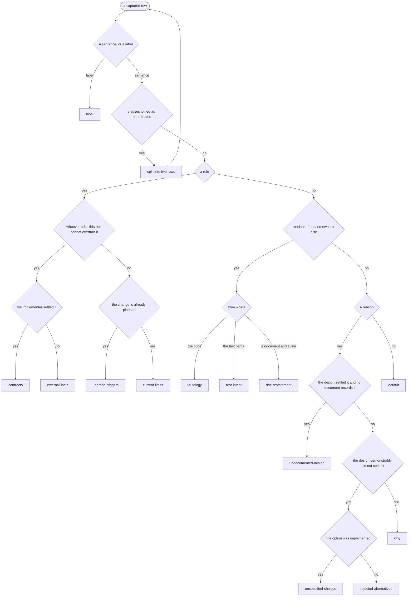

The first half of phase 2. Every row in `.periplus/pre.csv` comes out of this
carrying exactly one kind, and nothing outside that file has changed.

Splitting and naming are one job. A row holds one kind when it cannot be split
further. What decides it is how many claims the row makes, not how many names you
managed to fit.

## Read

`.periplus/pre.csv`, one row per line, no header:

```
<timestamp>,<file>,<line>,<kind>,"<the note>"
```

Rows with an empty fourth field are yours. Rows that already carry a kind were
classified in an earlier run — leave them exactly as they are. No file, or no
empty rows: report `Nothing to classify.` and stop.

**Do not read `.periplus/config.json`.** Where a kind goes is `/pp-resolve`'s
business.

## Kinds

Exactly one per row. The set is closed: a note that seems to need a fourteenth
kind is a note that has not been split far enough.

This table names the kinds. It does not say where any of them goes: that is
`.periplus/config.json`, which `/pp-resolve` reads and this file never restates.

<!-- criteria-table:start -->
| kind | which is |
| --- | --- |
| `external-facts` | a fact about the world outside the code that the code depends on — a browser quirk, the target device, the expected user, an external API limit |
| `contracts` | a constraint the implementer settled that something on the other side has to keep — a caller, or another file in this repository |
| `current-limits` | what this implementation does not do or cannot do yet, which reads as an oversight without it |
| `label` | a label rather than a sentence — it names the block of code below it |
| `undocumented-design` | the reasoning behind a design the design settled |
| `unspecified-choices` | a value or a shape the design did not specify, chosen at the implementer's discretion |
| `why` | the reasoning behind a design or an approach |
| `rejected-alternatives` | an option that was considered and turned down |
| `upgrade-triggers` | the condition under which this implementation should be revisited |
| `default` | none of the three — not a rule, not readable from anywhere else, not a reason |
| `tautology` | a restatement of what the code already shows — including a docstring summary naming what the function does |
| `doc-restatement` | a claim one of this repository's existing documents already makes |
| `test-intent` | what a test is checking — describe/it already says it |
<!-- criteria-table:end -->

`current-limits` and `upgrade-triggers` most often arrive as one note. A limit is
a property of the code as it stands; the intention to lift it some day is a plan.
Split on that line — what is true of the code now, against what is to be done
later.

## The tree

The table names the kinds; it does not separate them. This tree does. Follow it,
and take the kind it lands on.



### What counts as a document

Only what this repository keeps in a durable form. **The session does not count.**
A reason someone gave in conversation is a reason no document records: it goes
down the reason branch, not the readable-from-somewhere-else one.

Name the document and the line. Then check that the line makes the same claim —
**a line that says something else is not a restatement**, and a note that
contradicts a stale document is a reason.

### What counts as settled

Read the documents this repository keeps, then the code. `/pp` can also settle it
from the session it is running in. `/pp-refactor` reads the design documents in
its place, named at its scope step.

**What the design documents do not settle, the implementation settled.**

`readable from somewhere else` searches every document this repository keeps. Only
the design documents answer the two questions in the reason branch.

## Split unless there is a reason not to

Before naming anything, read each row with its subject filled in — the one the
sentence left out because the clause beside it had already supplied it. Some rows
arrive with no subject at all: write one for them. A row that can take no
predicate is not a sentence but a label, and a label is `label`.

Then assume the row is two. Wherever clauses are joined, split; if you do not,
say why in the report.

```
「update_all はモデルを更新しないので a.floor_layer_index は古い。割り当てた値をそのまま返す」
  → update_all はモデルを更新しないので … は古い   [external-facts]
  → このアクションは割り当てた値をそのまま返す      [tautology]
```

A subordinating join — `〜ため`, `〜ので`, *because* — is one claim and stays
whole. Coordinated main clauses — contrast, plain conjunction, a full stop — are
two. It is the join that decides, never the number of sentences.

The split is recursive: a half can hold two kinds of its own, or two claims of
the same kind.

Splitting a row replaces it with the rows it became, at the same `file:line`,
carrying the same timestamp.

Write each half in the language the row was captured in. Splitting is a cut, not
a rewrite — the subject supplied above is the one exception.

## Search the documents, one row at a time

`readable from somewhere else` asks whether one of this repository's documents
already says it. Search when a row reaches that question, for that row. **Do not
read the document tree first.**

File names are usually index enough to know where to look. Open the ones that
could hold it, and **read the line before claiming it**. If nothing turns up, the
row keeps the kind it would otherwise have had.

## What to write back

For each row settled: put the kind in the fourth field. Nothing else on the row
changes — the timestamp says when the note was captured, not when it was handled.
The note keeps its quotes, and a `"` inside it stays doubled to `""`.

```
2026-07-31T14:22,hooks/x.js,88,why,"タイムアウトが多発したため非同期にした"
```

Nothing else in `pre.csv` moves, and nothing outside it is touched.

## Output

Run by `/pp`, print nothing here — `/pp-resolve` reports these same rows. Hand it
the marks below: they are in no file, and nothing else can recover them.

Run alone, one line per row, in file order — `(split N/M)` on a row out of a
split, the reason on a row left whole where clauses were joined, the document and
the line on a `doc-restatement` row.

```
<file>:<line> [<kind>] — <the note in a few words>
hooks/x.js:88 [default] — 以前は同期だった (split 1/2)
hooks/x.js:88 [why] — タイムアウトが多発したため非同期にした (kept whole: cause)
hooks/x.js:88 [doc-restatement] — 種別の集合は閉じている (docs/adr/0014-...md:17)
```

End with `<N> rows classified, <M> from splits. Run /pp-resolve to deliver them.`

## Boundaries

`.periplus/pre.csv` is the only file this writes. It does not deliver, it does
not write to `log.csv` or `all.csv`, and it does not remove rows.

Say in the report that classifying alone leaves the source with no comments, and
unless the user asked for the halves separately, go straight on to `/pp-resolve`.
